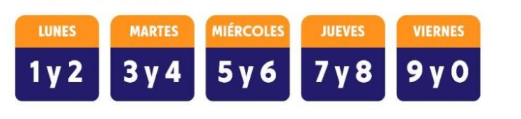

# Picoplaca Predictor

Project made as a technical test for the StackBuilders company, it is a License Plate predictor, which receives the license plate number, a date and a time, the program returns whether or not the car can circulate on the streets of Quito. 
The parameters that were taken into account are the following:
Schedule from monday to friday: 7:00 a.m. - 9:30 a.m / 4:00 p.m - 19:30 p.m

# Program Details

The development took placeusing React for the generation of the project along with Javascript as the main language. Different components were created, taking into account the graphical interface for the project and through the React router feature router were created.

For the design, Bootstrap was installed in order to make the entire interface more agile and SweetAlert was also used to customize the alert messages.

In this repository you will find the entire program, if you download it, you need to install the node_modules folder (npm install) and you can run the localhost server.
I am attaching a netlify link in case you want to try the application quickly in the browser.

picoplacapredictor.netlify.app
